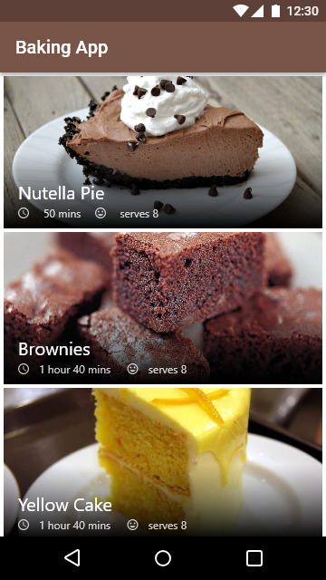
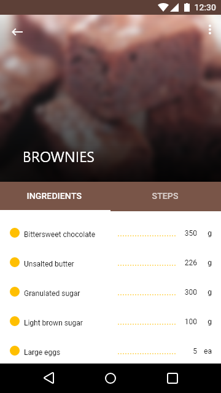
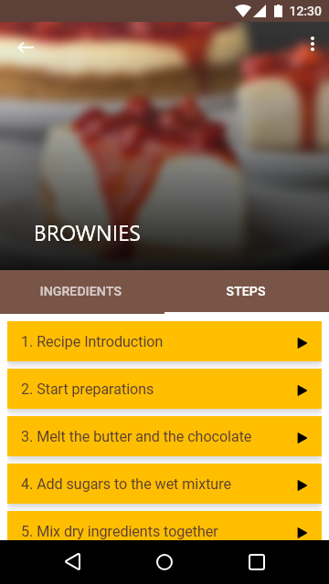
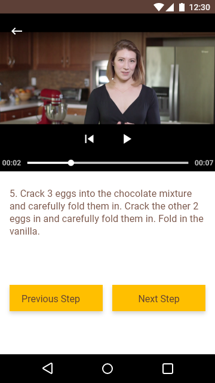

# Android Developer Nanodegree Program |  Baking App
In this project the task was to productionize an app, taking it from a functional state to a production-ready state. This ivolved finding and handling error cases, adding accessibility features, allowing for localization, adding a widget and a library.

# Project Description
The task is to create a Android Baking App that will allow Udacity’s resident baker-in-chief, Miriam, to share her recipes with the world. The app that will allow a user to select a recipe and see video-guided steps for how to complete it. 
The project involves handling media loading, verifying the user interfaces with UI tests, and integrating third party libraries. A complete user experience with a home screen widget will also be required.

 
 

# Pre-requisites
Android SDK v22
Android Build Tools v22.0.1
Android Support Repository v22.1.1

# Learning Objectives

- Use MediaPlayer/Exoplayer to display videos
- Handle error cases in Android
- Add a widget to your app experience
- Leverage a third-party library in your app
- Use Fragments to create a responsive design that works on phones and tablets
